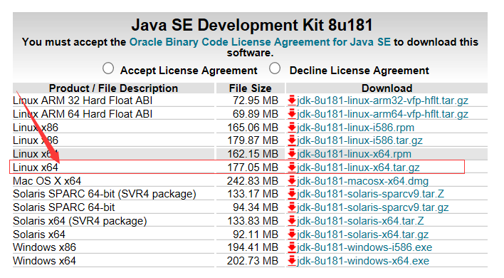
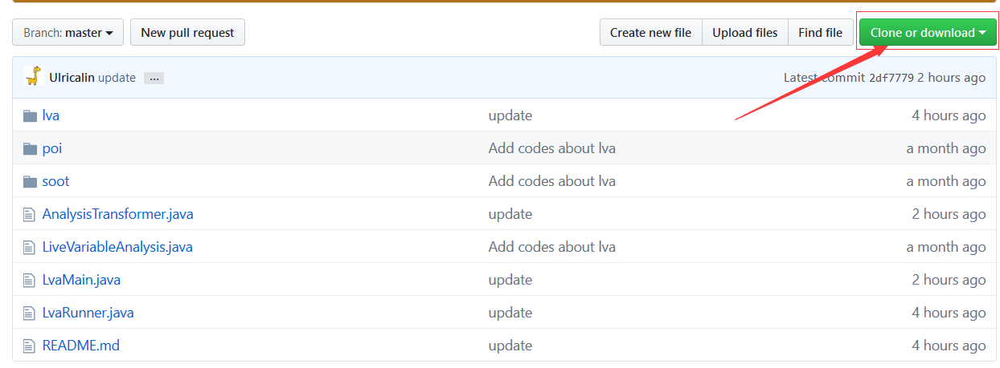
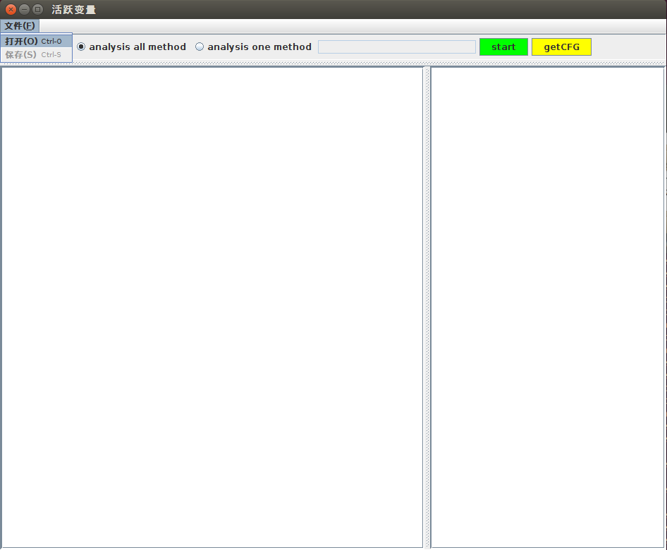
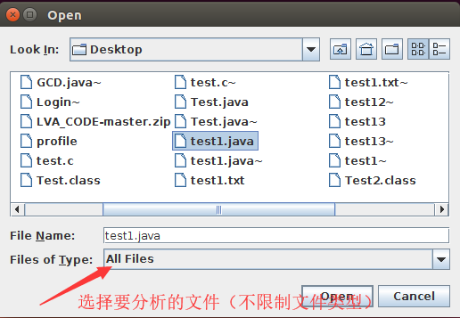
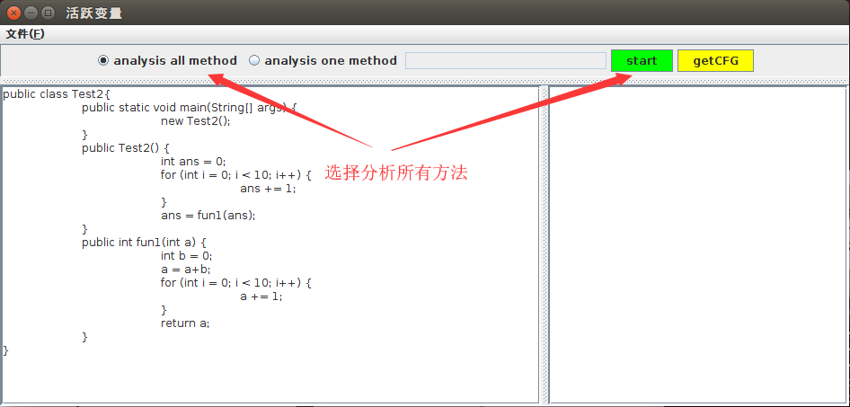
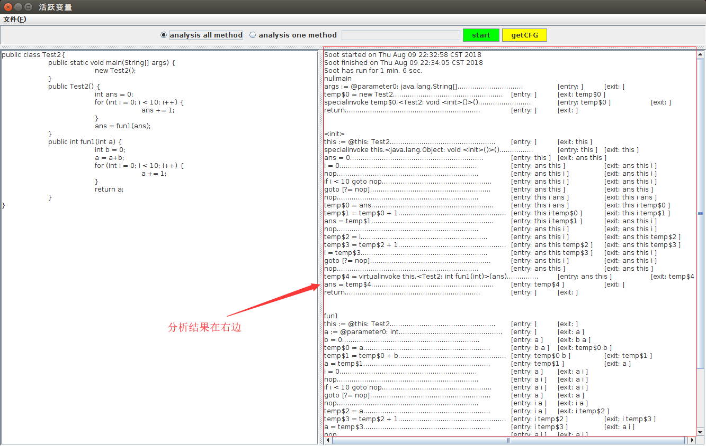
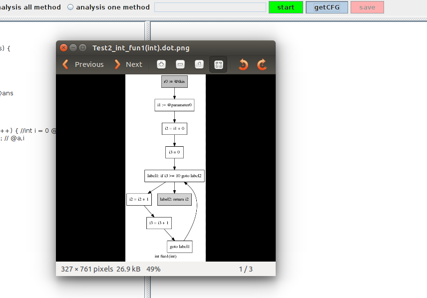
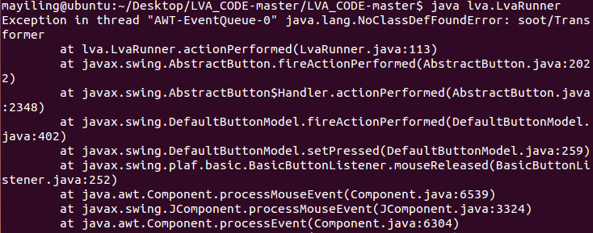
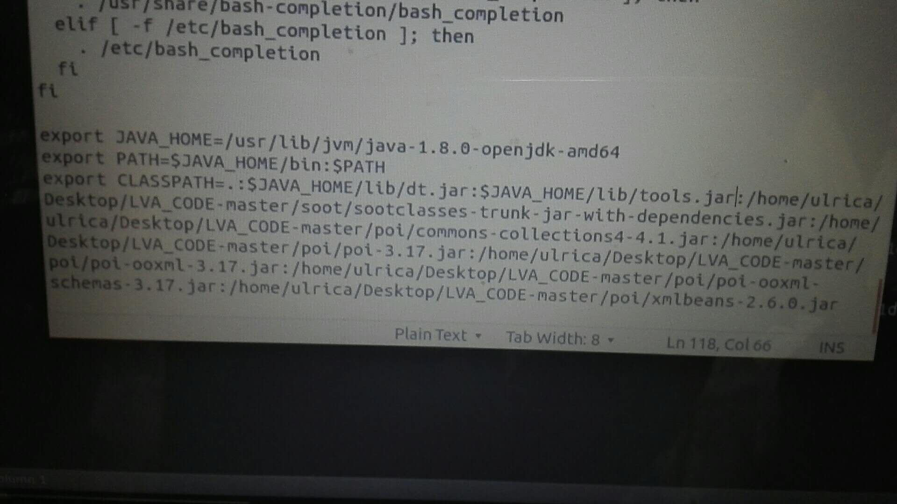

# 用户手册

## 前期准备：
1.官网下载JDK1.8，并配置环境变量。

下载网址：
http://www.oracle.com/technetwork/java/javase/downloads/jdk8-downloads-2133151.html

选择图中的文件下载并解压到任一文件夹A中。



之后添加环境变量
```
export JAVA_HOME=文件夹A的位置/jdk1.8.0_172
export CLASSPATH=.:$JAVA_HOME/lib/dt.jar:$JAVA_HOME/lib/tools.jar:$JAVA_HOME/lib
```
2.在Github上下载源码，并配置环境变量。

下载网址：
https://github.com/SYSU-Soot-LVA/LVA_CODE


点击图中的按钮进行下载，并将下载的 zip文件进行解压，解压到任一文件夹B中


之后添加环境变量【即添加soot/*.jar和poi/*.jar到环境变量CLASSPATH中】
```
export CLASSPATH=.:文件夹B所在位置/LVA_CODE-master/soot/sootclasses-trunk-jar-with-dependencies.jar:文件夹B所在位置/LVA_CODE-master/poi/commons-collections4-4.1.jar:文件夹B所在位置/LVA_CODE-master/poi/poi-3.17.jar:文件夹B所在位置/LVA_CODE-master/poi/poi-ooxml-3.17.jar:文件夹B所在位置/LVA_CODE-master/poi/poi-ooxml-schemas-3.17.jar:文件夹B所在位置/LVA_CODE-master/poi/xmlbeans-2.6.0.jar
```
## 运行步骤：
1.进入文件夹B/LVA_CODE-master中，执行命令java lva.Runner进行运行


2.会出现以下初始UI，点击“文件(F)”，选择“打开(O)”




3.选择文件页面


* 选择要选择的java class:


* 选择要选择的文件（不限制文件类型）：



注意：打开文件时，必须.java文件和对应的.class文件在同一目录中
4.选择文件后，进入选择分析方法页面

 * 选择分析所有方法：
 





 * 选择分析单个方法：

 


分析结果会出现在图的右侧




    
5.分析完毕后的页面

对于获得的分析结果，可以选择获得CFG和保存分析结果。

* 获得CFG：

点击“getCFG”，即可生成控制流图



* 保存分析结果：
点击“文件(F)”，选择“保存(S)”


## 可能出现的问题：
1.虚拟机内存分配不足导致运行失败


解决方法：
修改虚拟内存设置，修改方法可参考网址：
https://jingyan.baidu.com/article/925f8cb8a62e1ac0dde05602.html

2.设置环境变量出错



解决方法：
确定环境变量中JAVA_HOME,CLASSPATH是否和前期准备中提及的一致
可参考以下图的环境变量配置




