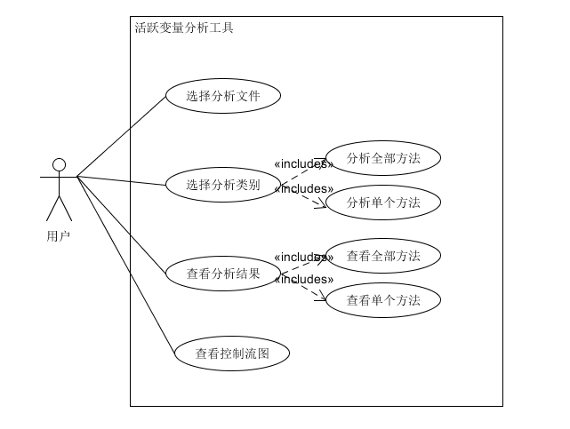
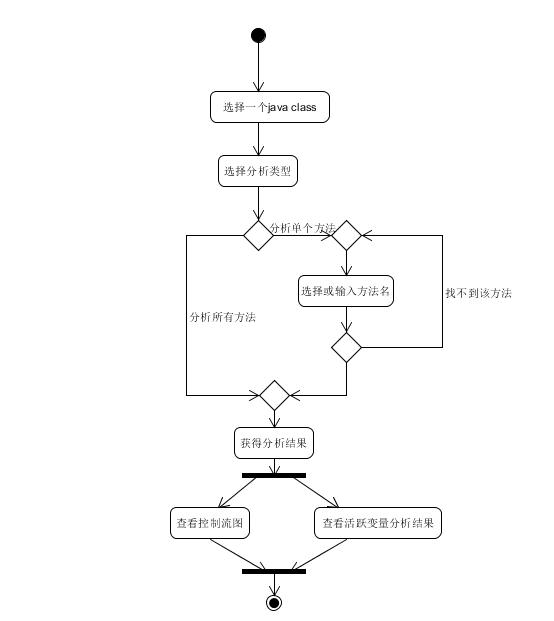
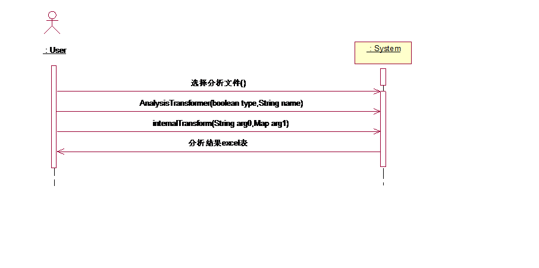
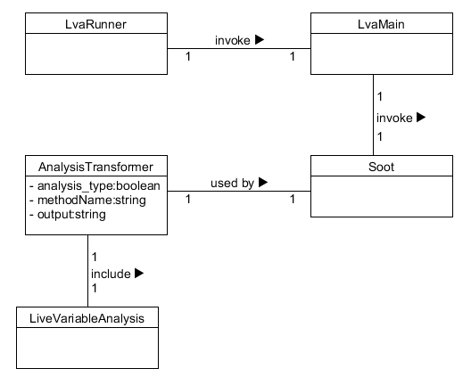
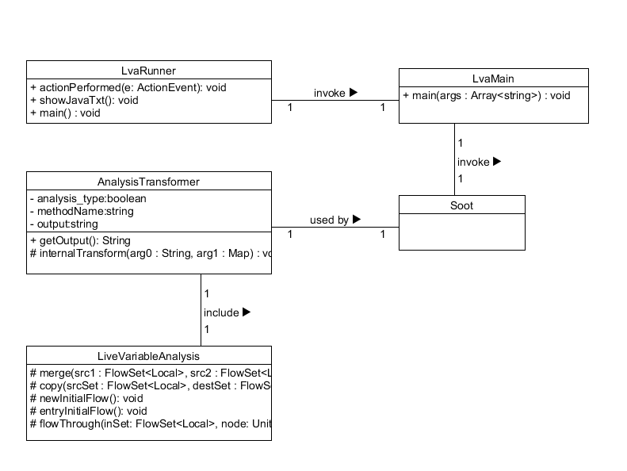
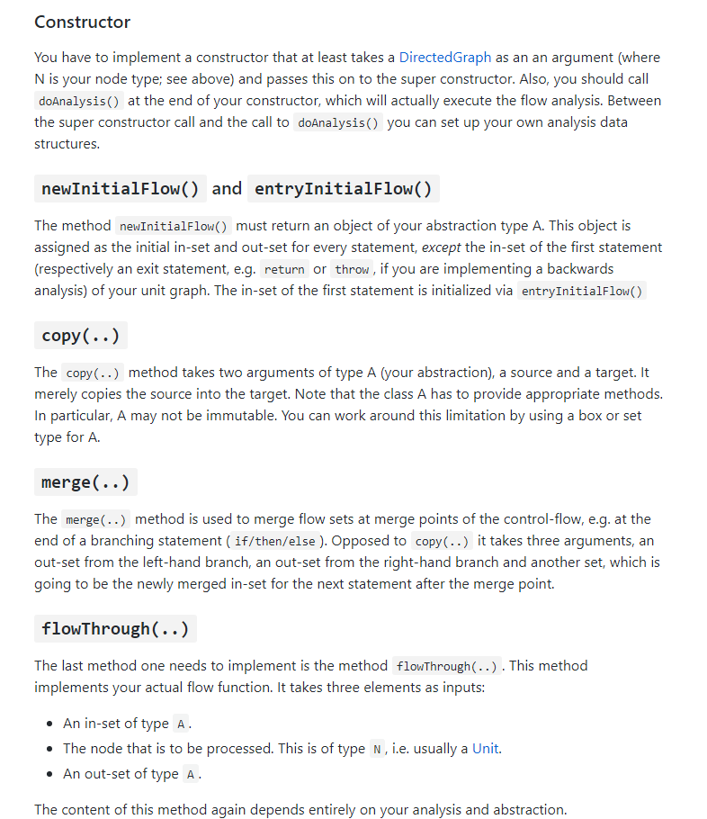
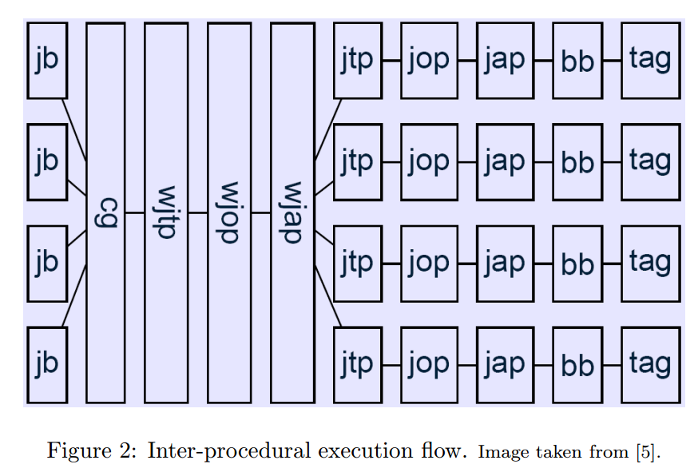

# 设计说明书

## 1. 引言

### 1.1 编写目的

本文档的目的是详细地介绍java静态测试工具--基于Soot平台的活跃变量测试工具的设计说明，包括项目的需求分析、总体设计、详细设计、测试设计等。

### **1.2 项目背景**

本文档介绍的产品是java静态测试工具--基于Soot平台的活跃变量测试工具，该工具面向软件测试人员和开发人员。

目标测试系统为中山大学高级实训（软件测试方向）的制品。

### 1.3 定义

**活跃变量分析**：对进行代码优化有重要作用。当我们在寄存器中计算一个值后，通常假设在某个块中还要引用它，如果它在该块的末尾是不活跃的，那么它在程序的后续过程中不再出现，即变得无用，那么我们不再需要存储改值；消除复制四元式的依据也是对活跃变量的分析，如果某个变量的值在以后不被引用，那么该复制四元式可以被消除。

### 1.4 参考资料

导师分派任务的PPT和相关讲义；

[Soot官网](https://github.com/Sable/soot)；

[Soot入门教程](http://sei.pku.edu.cn/~xiongyf04/SA/2015/14%20Soot%20-%20tanghao.pdf)；


## 2. 总体设计

### **2.1 目标**

基于Soot平台实现活跃变量分析，并实现可视化界面（包括装入待分析的Java源代码，启动分析，以合适的可视化图表展示分析结果）。

### 2.2 需求规格说明

请参考[需求规格说明书](./需求规格说明书.md )。

### 2.3 软件结构

用例图：



活动图：



顺序图：



领域模型：



类图：




## 3. 详细设计

#### 3.1 理论概述
对于变量x和点p，在控制流图（CFG）中沿从p开始的某条路径，是否可以引用x在p点的值。如果可以则称x在p点是活跃的，否则，x在p点就是无用的。

#### 3.2 公式原理
##### 前导定义
```text
in[B]: 基本块B的入口点的活跃变量集合。
out[B]: 是在基本块B的出口点的活跃变量集。
def[B]: 是在基本块b内的定义，但是定义前在B中没有被引用的变量的集合。
use[B]: 表示在基本块中引用，但是引用前在B中没有被定义的变量集合。
其中，def[B]和use[B]是可以从基本块B中直接求得的量，因此在方程中作为已知量。
```

##### 计算公式
```
in[B] = use[B] ∪(out[B]-def[B])
out[B] = ∪ in[S]，其中S为B的所有后继。
```
**变量在某点活跃，表示变量在该点的值在以后会被使用。**
- 第一个方程表示：
  - 一个变量在进入块B时是活跃的，如果它在该块中于定义前被引用
  - 一个变量在离开块B时是活跃的，而且在该块中没有被重新定义。
- 第二个方程表示：
  - 一个变量在离开块B时是活跃的，当且仅当它在进入该块的某个后继时是活跃的。

##### 原理剖析
显然，由于每个块的**def**和**use**集合是已知的，我们的任务就是求解**out**与**in**集合。显然，简单分析两个方程，我们便知道我们应当进行的是后向数据流分析。回顾我之前的学习报告，如果我们需要进行数据流分析，我们需要确定四个问题：
1. 决定分析的本质是什么：是否向前后者向后的数据分析？是否考虑分支，还是不进行考虑？等等

2. 确定自己想进行如何粗略的估计：是可能的分析还是必不可少的分析？从效果上看，你需要决定，在合并通过一个节点的信息的时候，你是需要进行结合还是切断？

3. 执行实际上的流： 本质上是为每一个处于中间状态的 声明 建立方程式。—— 如：任务声明应该如何被操作？

4. 确定初始的状态，或者入口节点的近似（如果是回溯的流程，那么是出口节点） 以及 中间节点——（或者是空集，或者是全集，这取决于分析的粒度。）

在这里我们解决了第一个问题，这是一个后向的数据分析。那么第二个问题，这是一个may还是一个must分析呢？
```
may分析要求宽松（并集），分析的结果包含正确的答案。
must分析要求严格（交集），分析的结果一定被包含于正确答案之内。
```
通过公式2可以得知，活跃变量分析应当是一个may分析（因为我们希望知道的是那些可能作为活跃变量的变量），因此我们将会在merge函数中采用并集的操作。第三个问题其实就是当控制流'流到''结点时我们应该如何操作，显然就是做上述def/use/in/out的计算。第四个问题也十分简单，对于其初始状态，我们仅需要设置出口节点的flowset为空集即可。

#### 实现的类与其功能
- LvaRunner
作为程序运行的UI交互类，负责接收用户指令并执行指令，输出结果/CFG图

- LvaMain
活跃变量分析的启动类，负责配置soot分析时的运行参数并调用Soot执行

- AnalysisTransformer
活跃变量分析的转换器类，负责将相关的方法生成CFG图并调用活跃变量分析方法，输出相应的分析结果

- LiveVariableAnalysis
活跃变量分析类，负责进行活跃变量分析

#### 关键代码分析


这里先贴上官方wiki对于我们写数据流分析框架的要求，可以看到我们需要重载的函数都在图上显示，接下来我们就开始进行代码分析。

- 声明
  首先我们进行类声明，这个过程比较简单，在这里不做赘述
```java
class LiveVariableAnalysis extends BackwardFlowAnalysis<Unit, FlowSet<Local>> 
{
...
}
```
- construtor
  接下来是构造函数，按照官方给的示例即可。
```java
public LiveVariableAnalysis(DirectedGraph g) {
	super(g);
	doAnalysis();
}
```

- newInitialFlow
  这个函数用于定义每个节点的in/out集合的初始状态，很简单，在我们没有进行计算前，我们均认为他们为空
```java
@Override
protected FlowSet<Local> newInitialFlow() {
	return new ArraySparseSet<Local>();
}
```
- entryInitialFlow
  这个就是要求里的第四点，同样的，空集合即可。
```java
@Override
protected FlowSet<Local> entryInitialFlow() {
	return new ArraySparseSet<Local>();
}
```

- merge
merge(..)方法被用来在control-flow的合并点处合并数据流集，例如：在句子(if/then/else)分支的结束点，一般根据待分析的具体问题来决定采用并集还是交集。
这个其实就是我们分析的第三点，由于是个may分析，我们的merge操作均采用并集的形式
```java
@Override
protected void merge(FlowSet<Local> src1, FlowSet<Local> src2, FlowSet<Local> dest) {
	// dest <- src1 U src2, 此处对应于out[B] = ∪ in[S]，其中S为B的所有后继。
	src1.union(src2, dest);
}
```

- flowthrough
  这个就是我们核心操作处理，按照给出的公式进行计算即可
```
@Override
protected void flowThrough(FlowSet<Local> inSet, 
	Unit node, FlowSet<Local> outSet) {
	// 后向分析，对应于公式 in、out相反
	FlowSet defs = (FlowSet)(new ArraySparseSet<Local>());

	for (ValueBox def: node.getDefBoxes()) {
		if (def.getValue() instanceof Local) {
			defs.add((Local)def.getValue());
		}
	}
	// out <- in - def
	inSet.difference(defs, outSet);

	// out <- out ∪ use
	for (ValueBox use: node.getUseBoxes()) {
		if (use.getValue() instanceof Local) {
			outSet.add((Local) use.getValue());
		}
	}
}
```


##### Extra
- Why ArraySparseSet？
  soot提供了四种FlowSet类型（关于FlowSet是什么，请查看`Soot Survivors Guide`的$5.6，这里不做赘述），我们的问题在于为什么使用这类型。这里一个关键点就是，在这样的一个分析中，我们并不能预先知道一个CFG中的节点的相关数据量的大小，因此基于此点这里便采用了ArraySparseSet。
- What is Local
  代码中另外一个令人迷惑的地方可能就是关于`Local`的使用。在官方的API中，是这样写的：`A local variable, used within Body classes. Intermediate representations must use an implementation of Local for their local variables.`也就是说，每一个Local类型变量都应当是属于该结点的一个局部变量。于是联系我们的代码我们就知道了，可以通过判断 `Value`的类型来决定它是不是一个局部变量(关于`Value`类型请查看`Soot Survivors Guide`的$2.2).


#### 如何添加分析
现在我们已经实现了活跃变量的分析框架，接下来的任务就是将之添加到Soot的运行中去。在这里首先需要了解关于soot的phase/pack的概念，这一部分可参考`Soot Survivors Guide` $4.1。我们的问题就是，在哪一个pack加入我们的分析呢？显然我们的分析是需要他生成CFG才可以进行，根据这信息，结合对于Soot各个pack产生的结果，我们最早可在`wjtp`阶段加入我们的分析器。因此也就选择了在`wtjp`阶段加入我们的转换器


#### 转换器如何写
关于`Transformer`可参考`Soot Survivors Guide` $6.1. 我们的目标在这里十分简单，写一个自己的`Transformer`，它继承于`BodyTransformer/SceneTransformer`,然后我们只需要重载其中的`internalTransform`函数即可。`BodyTransformer`针对单个方法体进行变换，`SceneTransformer`针对整个应用进行变换。显然，我们的活跃变量分析应当是针对整个应用进行分析，而不是仅仅分析某几个方法，因此我们选择继承`SceneTransformer`。官方wiki对于这一部分的代码介绍实在是过于简陋，并且基本也没有查找到类似的例子，最终在`Soot Survivors Guide` $5.8看到了关于这方面的知识点，然后通过查官方api，最终写出以下结果:
```java
package dfa;

import java.util.*;
import soot.*;
import soot.toolkits.graph.*;
import soot.toolkits.scalar.BackwardFlowAnalysis;
import soot.toolkits.scalar.FlowSet;


public class AnalysisTransformer extends SceneTransformer 
{

	@Override
	protected void internalTransform(String arg0, Map arg1) {

		for (SootClass sootClass : Scene.v().getApplicationClasses()){
			//遍历类中的每一个方法
            for (SootMethod sootMethod : sootClass.getMethods())
            {
                if (!sootMethod.hasActiveBody())
                {
                    continue;
                }
 
                // 获取当前Main方法中ActiveBody
				// ActiveBody: The body of a method contains 
				// the statements inside that method as well as 
				// the `local variable` definitions and the exception handlers.
                UnitGraph graph = new BriefUnitGraph(sootMethod.getActiveBody());

                // 执行活跃变量分析
				LiveVariableAnalysis analysis = new LiveVariableAnalysis(graph);

	
				Iterator<Unit> unitIt = graph.iterator();

				while (unitIt.hasNext()) {
					... // 此处执行我们的可视化输出
				}
			}
		}

	}
}
```


#### 配置函数
写好了这些，我们就可以写我们的配置函数，这个没有什么特别的地方，直接上代码:
主要在于soot.Main的参数配置，并加入自己的转换器
```java
package lva;

import java.util.Iterator;
import java.util.List;
import soot.*;
import soot.Body;
import soot.NormalUnitPrinter;
import soot.Scene;
import soot.SootClass;
import soot.SootMethod;
import soot.Unit;
import soot.UnitPrinter;
import soot.toolkits.graph.ExceptionalUnitGraph;
import soot.toolkits.graph.UnitGraph;
import soot.jimple.internal.*;

public class LvaMain
{

	public static void main(String[] args) {
		
		//要分析的class路径
		String classPath = args[0];
		//要分析的class名
		String mainClass = args[1];
		//要分析的类别 1-analysis all method, 0-analysis one method
		Boolean type = args[2].equals("true")? true : false;
		//要分析方法名（analysis one method时有效）
		String name = args[3];

		String[] sootArgs = {
			"-cp", classPath, "-pp",
			"-w", 						// 执行整个程序分析
			"-src-prec", "java",		// 指定源文件类型
			"-main-class", mainClass,	// 指定主类 
			"-f", "J", 					// 指定输出文件类型
			mainClass 
		};
		//加入自己的Transformer
		AnalysisTransformer analysisTransformer = new AnalysisTransformer(type,name);

		PackManager.v().getPack("wjtp").add(new Transform("wjtp.dfa", analysisTransformer));

		// 调用sootMain
		soot.Main.main(sootArgs);

		System.out.print(analysisTransformer.getOutput());
	}

}

```

## 4. 测试设计

请参考[软件测试计划](./软件测试计划.md)。

